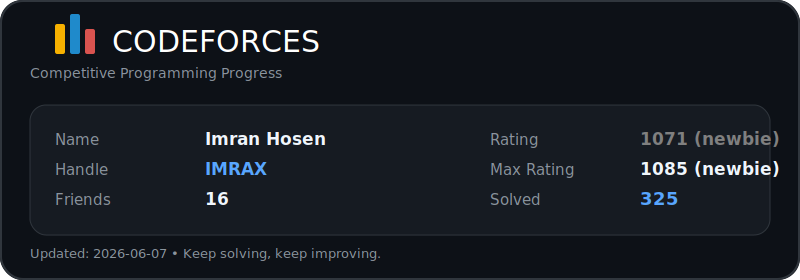

# Custom Codeforces Stats Card

A custom GitHub README stats card generator for Codeforces users.

This project fetches Codeforces profile data using the Codeforces API and generates a clean SVG card that can be displayed in any GitHub README.

## Features

- Fetches Codeforces user data
- Shows name, handle, rating, max rating, friends, and solved problems
- Generates a custom SVG stats card
- Automatically updates using GitHub Actions
- Easy to customize colors, layout, and fields
- Works directly inside GitHub profile README

## Preview

<div align="center">
  
</div>

## Tech Stack

- Python
- Codeforces API
- SVG
- GitHub Actions
- GitHub README

## Card Information

The generated card displays:

- Name
- Handle
- Friends
- Current Rating
- Max Rating
- Solved Problems

## How It Works

```txt
Codeforces API
      ↓
Python Script
      ↓
Generate SVG Card
      ↓
GitHub Actions Auto Update
      ↓
Display in README
```
## Author
Imran Hosen
```
GitHub: IMRAN-8
Codeforces: IMRAX
